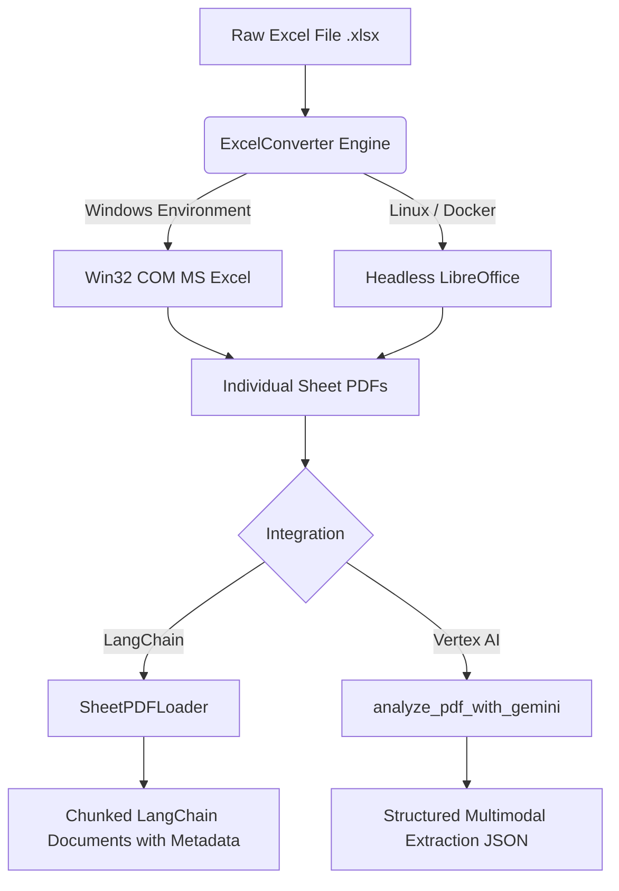

# sheet2pdf-rag


**sheet2pdf-rag** is a production-grade Python library designed to bridge the gap between complex financial Excel files and AI Retrieval-Augmented Generation (RAG) systems.

## 📖 The Problem

When building RAG systems on financial documents, standard spreadsheet parsers (like `pandas` or `openpyxl`) only extract cell data. They **completely ignore**:
- Floating text boxes
- Embedded images and guidelines
- Complex workflow drawings and flowcharts
- Visual topologies

**sheet2pdf-rag** solves this by orchestrating a headless conversion of Excel sheets into high-fidelity PDFs, and natively injecting them into your LangChain or Google Cloud Vertex AI pipelines. It automatically splits workbooks sheet-by-sheet to ensure semantic boundaries are maintained during downstream chunking.

---

## ⚡ Key Features

- **OS-Aware Conversion Engine**: Auto-detects your operating system. Uses native Microsoft Excel COM on Windows for 100% rendering fidelity, and gracefully falls back to a headless LibreOffice integration for Linux/AWS/GCP production servers.
- **Semantic Sheet Splitting**: Isolates contexts by converting workbooks into separate PDFs per sheet.
- **LangChain Native Loader**: Provides `SheetPDFLoader` which extends LangChain's `BaseLoader`, automatically tracking metadata lineage (`source_file`, `sheet_name`).
- **GCP Vertex AI Ready**: Directly pipe rendered sheets into Gemini 1.5 Pro to interpret visual topologies, flowcharts, and drawings.

---

## 🏗️ Architecture Overview



---

## 🚀 Installation

Install via `pip`:

```bash
pip install sheet2pdf-rag
```

**Optional Windows Extra:**
To enable the high-fidelity native Excel rendering engine on Windows, install the `windows` extras (installs `pywin32`):

```bash
pip install sheet2pdf-rag[windows]
```

### System Dependencies
- **Linux/macOS**: Requires LibreOffice (`sudo apt-get install libreoffice`)
- **Windows**: Microsoft Excel is preferred (auto-detected), but LibreOffice can also be used as a fallback.

---

## 💻 Usage Guides

### 1. LangChain Integration
The most powerful way to use this library is via the native LangChain loader. It converts the workbook and returns standard Document objects containing rich metadata.

```python
from sheet2pdf_rag import SheetPDFLoader

# Initialize the loader
# split_sheets=True ensures each sheet is kept semantically separate
loader = SheetPDFLoader("financial_report.xlsx", split_sheets=True)

# Load the documents
documents = loader.load()

for doc in documents:
    print(doc.page_content[:150])
    print(f"Source Path:  {doc.metadata['source']}")
    print(f"Sheet Name:   {doc.metadata['sheet_name']}")
    print(f"Engine Used:  {doc.metadata['engine_used']}") 
```

### 2. GCP Vertex AI (Multimodal Parsing)
For documents heavily reliant on diagrams and visual workflows, pass the generated PDFs directly to Gemini 1.5 Pro.

```python
from sheet2pdf_rag import analyze_pdf_with_gemini

results = analyze_pdf_with_gemini(
    sheet_path="guidelines_with_drawings.xlsx",
    prompt="Extract the core workflow topologies and decision trees shown in the images. Format as JSON.",
    model_name="gemini-1.5-pro-001",
    project="your-gcp-project-id"
)

for res in results:
    print(f"Sheet: {res['sheet_name']}")
    print(f"Analysis: {res['gemini_analysis']}")
```

### 3. Core Converter API (Standalone)
If you are integrating with other frameworks like LlamaIndex, Haystack, or AWS Bedrock, you can utilize the standalone core engine.

```python
from sheet2pdf_rag import ExcelConverter

# Auto-detects the best rendering engine for your OS
converter = ExcelConverter(engine="auto") 

# Convert the workbook
results = converter.convert(
    sheet_path="complex_data.xlsx", 
    output_dir="./output_pdfs", 
    split_sheets=True
)

for res in results:
    print(f"Successfully generated {res.pdf_path} from sheet '{res.sheet_name}'")
```

---

## 🤝 Contributing

Contributions are welcome! Please feel free to submit a Pull Request. For major changes, please open an issue first to discuss what you would like to change.

1. Fork the Project
2. Create your Feature Branch (`git checkout -b feature/AmazingFeature`)
3. Commit your Changes (`git commit -m 'Add some AmazingFeature'`)
4. Push to the Branch (`git push origin feature/AmazingFeature`)
5. Open a Pull Request

## 📄 License

Distributed under the MIT License. See `LICENSE` for more information.
